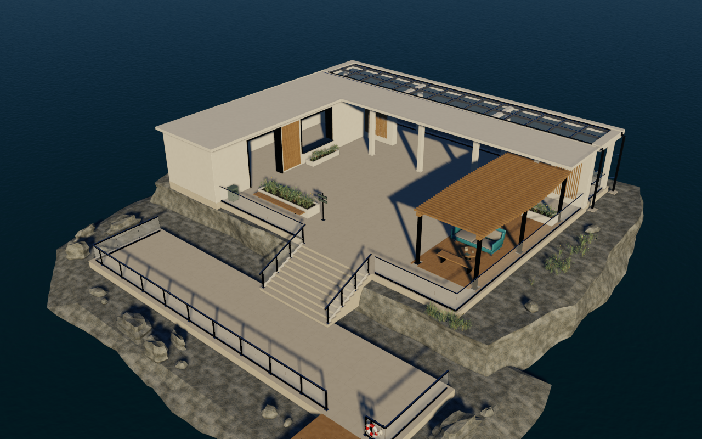

# Coastal Retreat Runtime bundle

The Coastal Atrium Demo (`--demo atrium`, persisted id
`Demo.Playground.CoastalAtrium`) loads this original project scene. It replaces
its Research Lounge presentation with a U-shaped coastal retreat, a continuous
L-shaped mineral roof, an open rear gallery and a same-level sea terrace.
Four pale piers support the glazed terrace roof; glass guards keep the ocean
view open. A straight timber dock, mooring pile and red/white lifebuoy establish
the arrival route. Roof glazing retainers and drainage, stair upstands, inset
planters and supported seating complete the construction details.
Keep the `.gltf`, adjacent `.bin` and `Textures/` directory together.
All geometry and textures are original project work; see the
[asset notices](../THIRD_PARTY_NOTICES.md#original-project-assets).

## Installed bundle identity

All Runtime inputs for this scene are tracked under
`Assets/Models/GGLabCoastalRetreat` in this repository. Builds, loading and
verification use the installed glTF Separate bundle directly. No asset
generation step or additional asset repository is required. The SHA-256 values
below identify the shipped files independently of authoring history.

The bundle has 554 unique glTF meshes, 742 placed mesh nodes, 769 total nodes,
206,264 unique / 1,304,222 placed triangles, twenty-three opaque materials,
one transparent glass material, twelve saved cameras and one reference Sun.
The glazing includes 28 roof panes and 70 guard panes. Twenty-four original
1024-square PNGs form eight PBR map sets: Retreat lime, stone, timber, sea and
leaf, plus the retained project rock, metal and upholstery maps. Base Color
uses sRGB; Normal and packed G roughness / B metallic use linear data through
UV0. Texture bytes and the repaired lounge front bevel normals are retained.

The installed glass uses core glTF `alphaMode=BLEND`, base-color alpha 0.18,
roughness 0.075 and metallic factor 0. It is the documented approximation for
this Runtime. The editable source uses physical transmission 0.96, IOR 1.5
and alpha 1; `KHR_materials_transmission` is removed from the shipped derivative.
All other export data and the binary/texture dependencies are retained. Alpha
blending does not establish physically correct glass refraction or transmission.

| Installed file | SHA-256 |
| --- | --- |
| `GGLabCoastalRetreat.bin` | `37e5946c63b4595b65f56e139de3ca9e24f6b3c6f0e40279e64075d921a38e3f` |
| `GGLabCoastalRetreat.gltf` | `ad85500288c58f66accc96dbb3992eae7f435fc7835ab12df8127aa38f2c7da4` |
| `Textures/CoastalRock_BaseColor.png` | `56c9d606ac6fa3bf7bcbf50a159660d93b349bc435a454bf811f6cc83cab62f9` |
| `Textures/CoastalRock_MetallicRoughness.png` | `4d9a8ab323d8cd305186df980a96471eb04eb482858bf43d79b8c4c580804342` |
| `Textures/CoastalRock_Normal.png` | `d2e0a7a84ca0761d316acb0a5297a9412d857a76907e69963fb38302f887d9f8` |
| `Textures/Metal_BaseColor.png` | `cc09b179567bac43a80d988a64d9089b7c00ea6aea5da00db1ac38b337936064` |
| `Textures/Metal_MetallicRoughness.png` | `fc86a16fe6f9bf0613593de00471673d0c625514934cea89a4d4c52f42024a1f` |
| `Textures/Metal_Normal.png` | `b027121d763390e6687f134c74b7ceaac0da4ab92a750536e582e841d15bb476` |
| `Textures/RetreatLeaf_BaseColor.png` | `484c83e4560db452521bfb92b7220063f7a153d5c6feb1be19285dda2fae949b` |
| `Textures/RetreatLeaf_MetallicRoughness.png` | `cf93da884bbc4864e42e6bf6df3ef440c01c07a52e824aee89f9881e56c7aca3` |
| `Textures/RetreatLeaf_Normal.png` | `42d35cbcad7f809413b345b6f2334f72df778fa71f65a522aef051b9a886853e` |
| `Textures/RetreatLime_BaseColor.png` | `4e6167e58c2b2f5ab4eaf612afefe4be4475f930510d566b37bc1d7f2b1e69e2` |
| `Textures/RetreatLime_MetallicRoughness.png` | `a4934b5f01d57b0541716a5e307279e69490abdd9cafc94da3bef832d1bc8ecd` |
| `Textures/RetreatLime_Normal.png` | `973d7b917704d3356e1bdc69e77b6ab8a807a1ac332f47c2197bb118c6c836ae` |
| `Textures/RetreatSea_BaseColor.png` | `f8eb6ed70d054cdbb0245e65abf3b8738b62ef0aced314ecf2a3dd300d66a191` |
| `Textures/RetreatSea_MetallicRoughness.png` | `bc3c844c0b33306104b24dc37ad20e5bd085864dd08a855d676d4dd042b79190` |
| `Textures/RetreatSea_Normal.png` | `d26dac42ed564f639b784cc8150778eb3b910c9a08b8365736dc8c73669fb053` |
| `Textures/RetreatStone_BaseColor.png` | `3e8b0c8b17638b8ac0b1399abd8e72cb1e20add0783c22e63d6aefb7c6096524` |
| `Textures/RetreatStone_MetallicRoughness.png` | `746aec17aa5ff97b9b419b01eeecb8b0dbe55cb29dbe084076308c1d177dee9f` |
| `Textures/RetreatStone_Normal.png` | `f495f98af96dfcc887a5eab0cc7d87c01621c792ec5adbc0057148961c3ac6f4` |
| `Textures/RetreatTimber_BaseColor.png` | `ccac841ba3b20c3978317f6866ccd38ceb78ff04f835d4b7fe0934d71f09f07b` |
| `Textures/RetreatTimber_MetallicRoughness.png` | `727737ccecffdd08de569a4473cd6145556b0d388e2c749c4e52afcdc0f71635` |
| `Textures/RetreatTimber_Normal.png` | `fe75dc3c10bb4d42ae5aa8e998446e85795da8b750e1fd1d7db31771b25c345d` |
| `Textures/Upholstery_BaseColor.png` | `8b609f23151ddc922cd926183f7aeb1b3e099ac0b8177d7553a6de943fa54f08` |
| `Textures/Upholstery_MetallicRoughness.png` | `15ea1ce5c4fc92f21e5588929b044b903ec137fbf15e44abcdb995a571ff1964` |
| `Textures/Upholstery_Normal.png` | `5f433933356f2de09dcf550a2cc1e1267ce74287d5b7a89795b08a73dcf4b3d6` |

The lounge front bevel repair is retained after lowering the seating by
160 mm. Imported coincident upper-front bevel corners must keep continuous
normals within the 0.0005 export-noise tolerance. The four legs have their
nonuniform seating scale applied to the source mesh, with inverse-transpose
custom normals, so Assimp graph optimization retains unit, orthogonal imported
normal/tangent frames. World-space shape, UVs and support contacts are preserved.
This guards against the
previous non-planar bevel classification error and its disconnected clearcoat
highlights. The source reference Sun remains `(1, 0.95, 0.85)`; this exported
light does not configure the Demo's Runtime Physical Sun.

## Physical daylight presentation

The Demo uses physical daylight, opaque PBR surfaces and transparent glazing. Its World has
the default Earth atmosphere and one designated Physical Sun, aligned with the
exported reference direction at 23 degrees elevation. The Sun uses 120,000 lux
top-of-atmosphere perpendicular illuminance and a 0.2666 degree angular radius;
the atmosphere attenuates direct sunlight consistently with the sky radiance.
`PhysicalSky` supplies the visible background and baked diffuse/specular IBL.
The Runtime publishes the Sun, Sky and IBL together after the GPU bake completes.
Environment intensity is 1, rotation is 0 and the skybox is enabled. The Demo
retains the selected IBL quality and restores the previous environment settings
on exit.

All fourteen reference views use profile version 2 with manual EV100 15 and
zero exposure compensation. They share a 6000 m far plane so the sea and distant
coast remain visible, including from the retained horizon and interior views.
Scene pre-exposure is enabled, using
`1 / (1.2 * 2^15)` for both exposure and pre-exposure. Reference restoration also
restores this exposure contract after camera or lens edits. Temporal
anti-aliasing (TAA) is enabled with the Runtime's default settings; GTAO and Bloom
remain disabled in the Demo's view profile. Reference restoration resets temporal
history. Allow 64 settled frames per view for repeatable TAA captures.
The internal view collection is
`CoastalSceneReferenceViews.h`; `--demo atrium`, the persisted Demo id and all
existing view ids remain stable. Frozen profile-version-1 captures retain their
original settings and are not exposure-matched baselines for this presentation.

## Runtime views and verification

The Demo starts at `Retreat_Overview`. Five Retreat reference views register the
authored positions, targets and exported vertical FOV in runtime coordinates,
mapping Blender `(X, Y, Z)` to `(X, Z, Y)` in meters. They use a 0.05 m near plane,
6000 m far plane and reference aspect 16:10. Camera restoration
keeps the actual viewport aspect. The eight preceding Atrium reference views
remain available with their original poses, field of view, near planes and
reference aspects, with the far plane extended to the same coastal range.

| View | Purpose |
| --- | --- |
| `Retreat_Hero` | Whole island, sea and distant landforms |
| `Retreat_Courtyard` | Open gallery, planting and timber screening |
| `Retreat_Lounge` | Lounge, deck and supported table props |
| `Retreat_Planting` | Foliage, soil and planter seating detail |
| `Retreat_Overview` | Island layout, glazed sea terrace and arrival route |

`Retreat_GlassTerrace` is a temporal evaluation view defined in code rather than an
authored camera: it looks through the sea terrace guard glass toward the sun glint,
the dock and the lifebuoy, with a 0.1 m near plane. The `SEQ_StaticGlassTerrace` and
`SEQ_PanGlassTerrace` camera paths start from it.

The production import suite checks placed triangles per material, explicit
opaque and glass blend bindings, finite geometry, orthonormal tangent frames,
normal continuity at both
upper front armrest bevels and all twenty-four textures' semantic decoding and
mip chains. Build WinApp and ShaderCompiler
from the same code revision, then run from the code repository root:

```powershell
Build/Output/x64/Debug/GraphicsGadgetLab.exe --self-test app-content-registration
$retreatStateRoot = Join-Path (Get-Location) 'Build/Sessions/retreat-dx12/State'
powershell -NoProfile -ExecutionPolicy Bypass -File Scripts/GGLabSession.ps1 start -Session retreat-dx12 -Rhi dx12 -Demo atrium -WindowSize 1280x800 -NoDevTools -StateRoot $retreatStateRoot
powershell -NoProfile -ExecutionPolicy Bypass -File Scripts/GGLabSession.ps1 batch -Session retreat-dx12 -SettleFrames 64
powershell -NoProfile -ExecutionPolicy Bypass -File Scripts/GGLabSession.ps1 stop -Session retreat-dx12
```

Repeat with `-Rhi vulkan` and a separate session id. Sessions are hidden by
default. See [Frame Capture](../../../Docs/FrameCapture.md) for sidecars and
cross-backend comparisons. Import checks and shader compilation alone do not
establish visual correctness.

Installed-bundle verification on 2026-10-08: Debug WinApp and ShaderCompiler
built with the x64-hosted MSVC toolchain, with zero build errors or warnings.
`app-content-registration` passed all 314 checks against the installed public
assets, including all 24 named materials and their placed triangle counts,
texture decoding/mips, orthonormal imported vertex frames, camera/exposure
restoration and the six registered temporal camera-path contracts. Both upper
front armrest bevels had maximum coincident normal delta 0.000173, below 0.0005.

The source acceptance retained world-space sofa-leg positions/normals/UVs and
all unrelated authored state, exercised complete construction negative fixtures,
and verified two byte-identical 26-file exports. Both the physical and shipped
Runtime-profile glTF were reimported and checked for geometry, supports,
construction joints and open routes.

Fresh hidden DX12 and Vulkan sessions loaded the normal Debug executable and
this public bundle directly. Each captured all thirteen reference views at
1280 x 800 after 64 settled frames, with DevTools disabled and every readiness
gate ready. All 26 images and sidecars were reviewed; both sessions exited 0.
All thirteen cross-backend pairs passed `MaxMeanError=1`,
`MaxDifferingPercent=1` and channel threshold 8. Maximum mean absolute RGB error
was 0.4979 / 255; at most 0.02% of pixels exceeded the threshold. Compared
presentation settings agreed; only `time.totalTime` differed.

No assertion, validation error or upload failure was reported. Both backends
logged the startup HDR FP16 sanitization warning. Vulkan logged unused vertex
outputs at locations 5 and 8 as performance warnings. Release, interactive
Demo switching, TAA quality during camera motion and performance/LOD
qualification were not run for this asset installation. Older captures are
historical evidence; compare current captures against the installed file
identities above.



## Presentation limits

GGLab uses the Demo's existing runtime lighting and post-processing. Blender
World lighting, Cycles, AgX, depth of field and Hero's off-centre lens shift are
not glTF rendering contracts; the runtime Hero camera uses a symmetric
projection. Runtime Physical Sun, Sky and IBL use the daylight contract above.
The sea is static opaque PBR geometry. Vegetation is static
solid geometry; this import adds no plant LOD, wind animation or performance
budget guarantee. The construction details express architectural intent and
have no structural or drainage-capacity certification. Existing Atrium/Research
Lounge exports and their frozen capture baselines retain their bytes.
