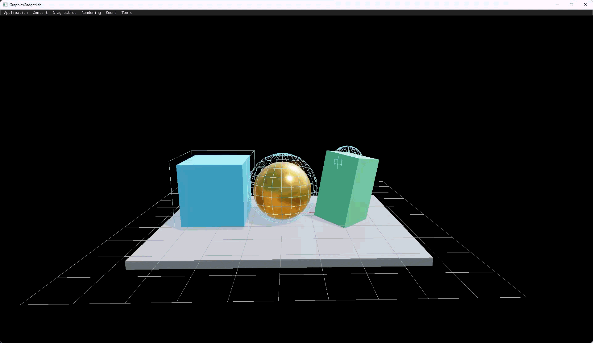

# Graphics Gadget Lab

Graphics Gadget Lab (gglab) is a personal graphics research playground built
with C++, Direct3D 12, and Vulkan 1.3.

It is used to experiment with rendering techniques, GPU resource management,
render graphs, shaders, diagnostics, and small self-contained graphics Labs.

## Start Demo

## Highlights

- Runtime-selectable Direct3D 12 and Vulkan renderers with DXC and HLSL
- Render graph and reusable render-pass pipeline
- Runtime-selectable Labs for focused experiments
- ImGui-based diagnostics, GPU profiling, and developer tools on both RHIs
- GPU resource, asset, and shader management experiments

## Build

Requirements:

- Windows 10 or later
- Visual Studio 18 Insiders with the v143 toolset
- Windows SDK
- Git submodules initialized
- Vulkan SDK 1.3.296 (optional; required for the Vulkan backend)

Open `GraphicsGadgetLab.sln`, then build the `WinApp` project for x64.

The main executable is written to:

    Build/Output/x64/Debug/GraphicsGadgetLab.exe

The Vulkan backend is enabled by default (`GGLAB_ENABLE_VULKAN=1`). It uses
the Vulkan SDK discovered through the `VULKAN_SDK` environment variable and
links `vulkan-1.lib`; the runtime uses the system Vulkan loader. Set
`GGLAB_ENABLE_VULKAN=0` for a DX12-only build that does not require the
Vulkan SDK.

## Run a Lab

    GraphicsGadgetLab.exe --rhi dx12 --lab gglab.lab.mini_pbr_grid --absolute-mouse
    GraphicsGadgetLab.exe --rhi vulkan --lab gglab.lab.mini_pbr_grid --absolute-mouse

Run with `--help` to see the available startup options.

The application starts in FPS mouse mode. Press `T` to release the cursor and
interact with the developer UI.

## RHI backend selection

    GraphicsGadgetLab.exe --rhi vulkan
    GraphicsGadgetLab.exe --rhi dx12
    GraphicsGadgetLab.exe --list-adapters
    GraphicsGadgetLab.exe --rhi vulkan --adapter <index|identity-prefix>

The default backend is DX12. An explicit `--rhi vulkan` creates a Vulkan
instance, Win32 surface, enumerates and evaluates every physical device
against the GGLab Vulkan device profile, and creates a logical device and
graphics/present queue; it never falls back to DX12. `--list-adapters` prints
the profile evaluation for every adapter.

Hardware qualification is a separate privileged executable:

    GGLabVulkanQualification.exe [--adapter <index|identity-prefix>]

`GGLabVulkanQualification` owns the authoring-time shader compiler and DXC
dependencies required by the qualification probe. The normal `WinApp` target
does not link the Shader Toolchain or DXC and no longer accepts the former
`--vulkan-qualification` option.

Vulkan uses the normal Application, Renderer, RenderGraph, and backend-neutral
RHI path. Production coverage includes graphics and direct-compute command
encoding, bindless material resources, Texture2D/TextureCube sampling, depth
and directional shadows, Forward PBR, IBL and skybox rendering, Forward+,
GTAO, post processing and tone mapping, ImGui, and timestamp-based GPU
profiling. Debug builds request `VK_LAYER_KHRONOS_validation`; validation
availability, errors, and warnings are hard qualification gates.

The Vulkan diagnostics panel reports adapter/profile identity, validation
counts, descriptor publication and retained backing state, VMA heap budgets,
resource retirement, pipeline/layout counts, frame-slot versus swapchain-image
indices, timeline progress, and the first fatal/device-lost operation. Native
Vulkan pipeline-cache persistence is deliberately deferred; pipeline objects
are cached only for the current process.

CI installs the pinned SDK and runtime, then builds Debug, Release, and Debug
without PCH. Each leg runs the Application, Foundation, Runtime, rendering,
shader compile, and Vulkan contract suites. Hardware presentation qualification
is performed separately on supported Windows adapters because hosted CI does
not provide a conformant display GPU.

## Self-tests

First-party headless self-tests run as one executable per domain:

| Executable | Command | Coverage |
|---|---|---|
| `GraphicsGadgetLab.exe` | `--self-test all` | Application-owned in-app suites (`app-launch-options`, `app-devtools-view-profile`, `napa-voxel`) |
| `GGLabVulkanQualification.exe` | `--self-test` | Headless qualification launch and validation-gate contracts |
| `GGLabRuntimeTests.exe` | `--suite all` | Runtime/Foundation contract suites (`artifact-cache`, `asset-data`, `asset-upload-scheduler`, `publication-accounting`, `shader-artifact-runtime`, `rendering-contracts`, `vulkan-contracts`) |
| `GGLabAppRuntimeTests.exe` | (no arguments) | Host-neutral Application lifecycle and service-composition contracts |
| `GGLabShaderToolchainTests.exe` | `--suite all` | Toolchain-owned CLI, compiler-process, and immutable artifact-publication contracts without Runtime/RHI dependencies |
| `GGLabShaderRuntimeIntegrationTests.exe` | `--suite all` | Cross-domain Toolchain, Runtime/RHI ABI, production shader, and artifact-consumption integration contracts |
| `NapaVoxelCoreTests.exe` | `--suite all` | Pure NapaVoxelCore suites compiled as C++20 (`build-contract`, `coordinate`, `damage`, `edit`, `hash`, `mesher`, `multi-chunk`, `mutation`, `primitive`, `restore`, `storage`, `publication-data-only`) |
| `GGLabFoundationTests.exe` | (no arguments) | Foundation public-header link probe |

Use `--suite <id>` to select one suite in the domain test executables. CI runs
all eight executables on the applicable build legs; actual hardware qualification remains
a manual gate on supported Windows adapters.

## Status

gglab is an evolving personal research project. Its architecture and
experiments may change as new graphics ideas are explored.
