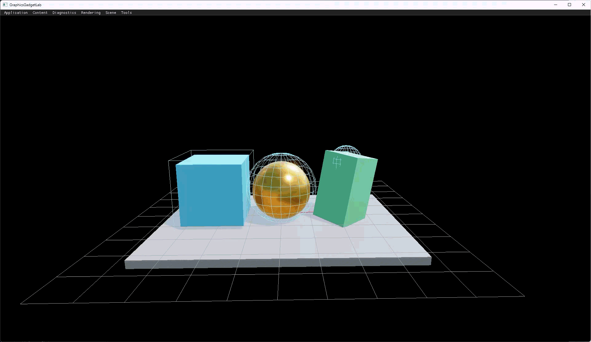

# Graphics Gadget Lab

Graphics Gadget Lab (gglab) is a Windows graphics research playground built with
C++20, Direct3D 12, Vulkan, DXC, and HLSL.

It provides focused graphics Labs for exploring rendering techniques, improving
visual quality, and experimenting with GPU resources, shaders, and diagnostics.

## Highlights

- Runtime-selectable Direct3D 12 and Vulkan backends
- Render graph and reusable render-pass pipelines
- PBR rendering, physical sky lighting, shadows, and post processing
- Focused Labs for graphics experiments
- ImGui-based developer tools, diagnostics, and GPU profiling

## Demo

